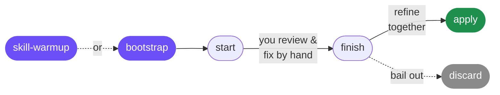

<div align="center">

# 🧠 retro-review

### Turn your code reviews into skill rules that stick.

*The model writes the code. You fix the last 10% by hand. Retro Review learns from those fixes so the same mistake never comes back.*


</div>

---

## The pain it solves

You ask a model to implement something. It gets you 90% of the way. Then you review the diff and fix the last 10% by hand before pushing — the small corrections that are the real difference between *what the model writes* and *what your codebase accepts*.

Those fixes are gold. But they disappear into a git commit, and next week the model makes **the same mistake again**.

**Retro Review closes that loop.** It freezes what the model delivered, diffs it against your hand-fixes, and — after you confirm which changes were real mistakes (not just preferences) — turns each systematic mistake into a **skill rule backed by an eval** that proves it would have caught the bug. Your skills get sharper every review, automatically.

---

## How to use it



**Once per repo** — set it up and tell it which agent reviews your code:

```
/retro-review:bootstrap
```

**Or start warm** — instead of an empty setup, `/retro-review:skill-warmup` reads your project, infers its architecture (Clean Arch, DDD, hexagonal…), and through a chat about how you like to build, scaffolds **one skill per layer** seeded with best practices — then offers to create a code-review agent and wires it in. Phase zero: seed the rules before the model even makes a mistake.

**Then, every time the model delivers a feature:**

| Step | Command | You do |
|---|---|---|
| 1 | `/retro-review:start` | Freeze the delivery — *before* you touch it. |
| 2 | — | **Review and fix the code by hand**, like you always do. |
| 3 | `/retro-review:finish` | It diffs your fixes and asks, block by block: *model mistake or your preference?* Only mistakes become proposals. |
| 4 | `/retro-review:apply` | Refine together, then it applies each rule and validates it with an eval (must fail before, pass after). |

Changed your mind mid-cycle? `/retro-review:discard` drops everything — nothing applied, nothing saved.

**Housekeeping, anytime** — `/retro-review:optimize-skills` sweeps your skills and trims them lean: cuts redundant/padding content, surfaces conflicting rules and stale references, all while their own evals prove behavior didn't change (green before, green after).

> The whole tool turns on one question, asked in `finish`:
> **Is this a fix for a model mistake, or just your preference?** Preferences and one-off slips are filtered out — only *systematic* mistakes become rules.

---

## Commands at a glance

| Command | When | What it does |
|---|---|---|
| `/retro-review:bootstrap` | once per repo | Empty setup — writes `config.yaml` and asks which agent reviews your code. |
| `/retro-review:skill-warmup` | once, early (instead of bootstrap) | **Phase zero.** Reads the project, infers its architecture, and through a chat scaffolds **one skill per layer** seeded with best practices — then offers to create a code-review agent and wires it in. |
| `/retro-review:start` | model just delivered | Freezes the delivery across every nested repo — *before* you touch it. |
| `/retro-review:finish` | after your hand-review | Diffs your fixes, triages mistake vs. preference, writes eval-backed proposals + a utilization score. |
| `/retro-review:apply` | proposals ready | Applies each rule and proves it with an eval (fail before → pass after), archives a lean summary, wipes the cycle. |
| `/retro-review:discard` | changed your mind | Drops the open cycle — nothing applied, nothing saved. |
| `/retro-review:optimize-skills` | anytime (housekeeping) | Trims skills lean — cuts redundancy, surfaces conflicts and stale references — with each skill's evals proving behavior didn't change. |

---

## What you get

- **🧩 Skill rules that stick** — every rule is validated by an eval (fails on the old skill, passes on the new one). No hand-waving.
- **📊 Utilization score** — `finish` tells you how much of the model's code you kept (*"you had 92% utilization"*), so you can watch whether the model is getting better on your codebase over time.
- **⚡ Monorepo-native** — one snapshot spans every nested git repo under your root, auto-discovered and captured in parallel. No per-repo config, and it's fast (no full-worktree scans).
- **✂️ Lean by design** — adjustments are the smallest edit that passes the eval. Your skills stay a set of sharp rules, not a growing pile of examples.

---

## Install

```
/plugin marketplace add eduardohr-muniz/retro-review
/plugin install retro-review
```

Registers the `/retro-review:*` commands and the `retro-review` agent.

---

## Config

`bootstrap` creates `retro-review/config.yaml` at your repo root:

```yaml
code_review_agent: codereview   # the agent that reviews your code — retro-review suggests checks for it
language: en                    # prose only (IETF tag) — your code & skills stay as they are
paths:
  cycles: retro-review/cycles
  archive: retro-review/archive
```

The working cycle lives under `retro-review/` and is **ephemeral** — each cycle is wiped on `apply` (or `discard`), leaving only a one-line summary in `archive/` for recurrence detection. The evals it writes go to the **target skill**, because each skill carries the cases that test it.

---

<div align="center">

*Every mistake the model makes is a rule your skills are missing — and a check your reviewer forgot.*
**Retro Review makes both permanent.**

</div>
